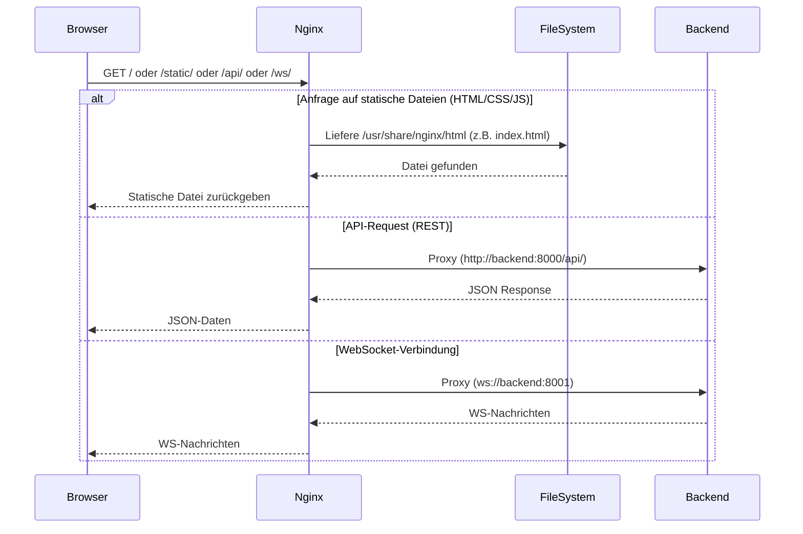
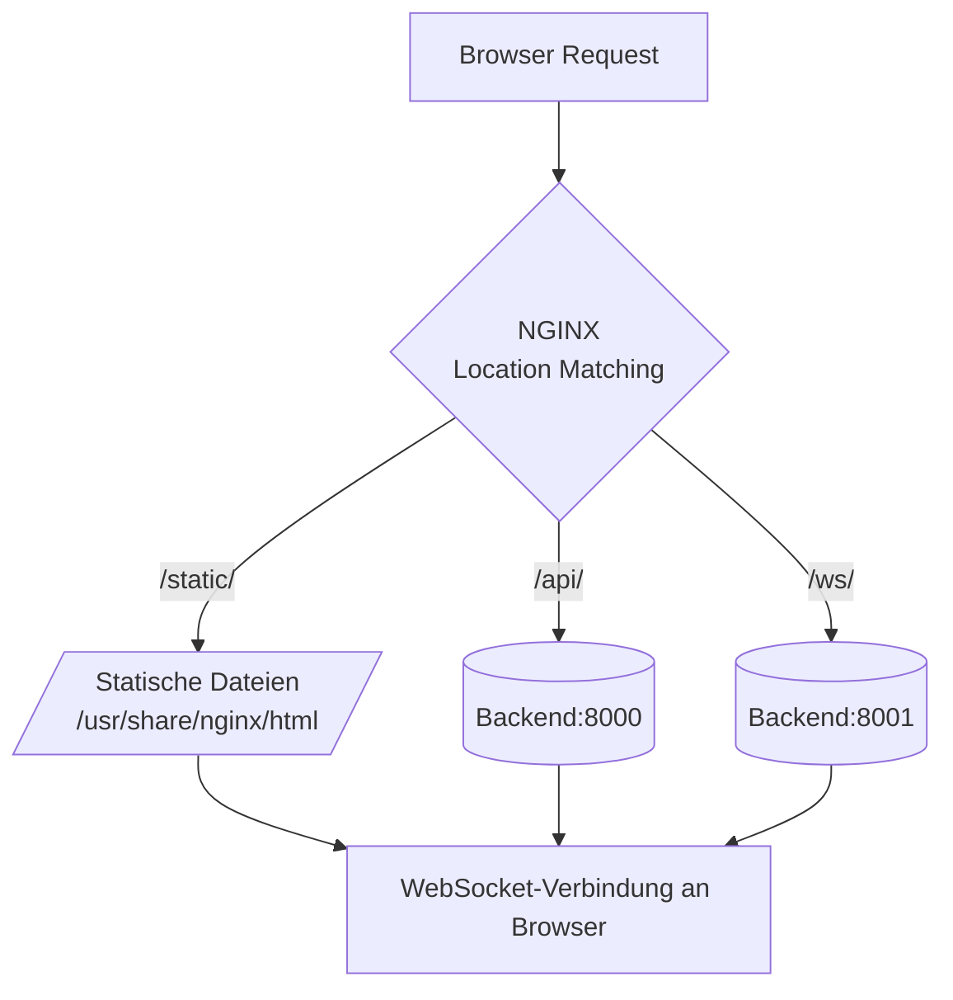

```mermaid

sequenceDiagram
    participant Browser
    participant Nginx
    participant FileSystem
    participant Backend

    Browser->>Nginx: GET / oder /static/ oder /api/ oder /ws/
    
    alt Anfrage auf statische Dateien (HTML/CSS/JS)
        Nginx->>FileSystem: Liefere /usr/share/nginx/html (z.B. index.html)
        FileSystem-->>Nginx: Datei gefunden
        Nginx-->>Browser: Statische Datei zurückgeben
    else API-Request (REST)
        Nginx->>Backend: Proxy (http://backend:8000/api/)
        Backend-->>Nginx: JSON Response
        Nginx-->>Browser: JSON-Daten
    else WebSocket-Verbindung
        Nginx->>Backend: Proxy (ws://backend:8001)
        Backend-->>Nginx: WS-Nachrichten
        Nginx-->>Browser: WS-Nachrichten
    end
```

```mermaid
flowchart TB
    A[Browser Request] --> B{NGINX<br/>Location Matching}
    B -->|/static/| C[/Statische Dateien\n /usr/share/nginx/html/]
    C --> E[Liefer Datei an Browser]

    B -->|/api/| D[(Backend:8000)]
    D --> E[JSON Response an Browser]

    B -->|/ws/| F[(Backend:8001)]
    F --> E[WebSocket-Verbindung an Browser]

```