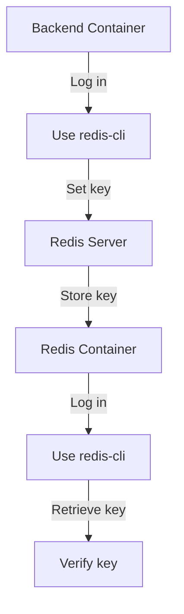

# Redis Check Guide

## 1. Write to Redis from the Backend Container

### Step 1: Log into the `ft_transcendence_backend` Container

If your container has Bash, use:
```sh
docker exec -it ft_transcendence_backend bash
```

If Bash is not available, try:
```sh
docker exec -it ft_transcendence_backend sh
```

### Step 2: Use Redis-CLI

If Redis-CLI is not installed, install it (for Debian/Ubuntu-based containers):
```sh
apt-get update && apt-get install -y redis-tools
```

Connect to the Redis server:
```sh
redis-cli -h ft_transcendence_redis -p 6379
```

### Step 3: Set a Key in Redis

In Redis-CLI, set a key:
```sh
SET test_key "Hello from backend!"
```

### Step 4: Verify the Key

Check if the value is set correctly:
```sh
GET test_key
```
You should see `"Hello from backend!"`.

### Step 5: Exit

Exit Redis-CLI and the container:
```sh
exit
```
or press `Ctrl+C`.

## 2. Verify Data in the Redis Container

### Step 1: Log into the `ft_transcendence_redis` Container

Use the command:
```sh
docker exec -it ft_transcendence_redis bash
```

If Bash is not available, try:
```sh
docker exec -it ft_transcendence_redis sh
```

### Step 2: Start Redis-CLI

In the Redis container, start Redis-CLI:
```sh
redis-cli
```

### Step 3: Retrieve the Stored Key

Check the key:
```sh
GET test_key
```

List all keys:
```sh
KEYS *
```
You should see `test_key` with the value `"Hello from backend!"`.

### Step 4: Exit

Exit Redis-CLI and the container:
```sh
exit
```
or press `Ctrl+C`.

## Summary

### Backend Container:
- Log in
- Use `redis-cli -h ft_transcendence_redis -p 6379`
- Set a key with `SET test_key "Hello from backend!"`

### Redis Container:
- Log in
- Use `redis-cli`
- Retrieve the key with `GET test_key`

