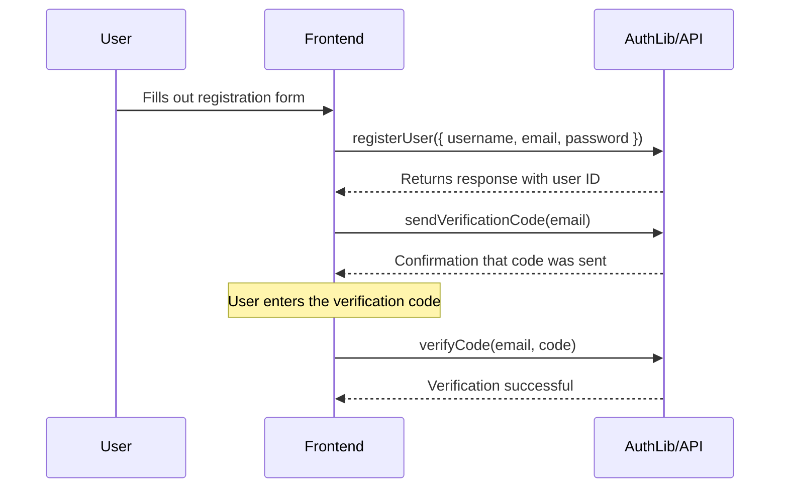
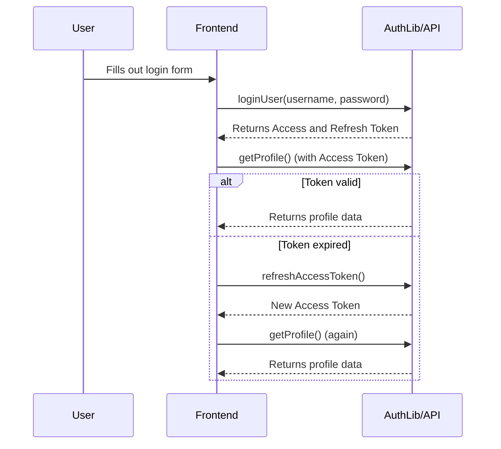
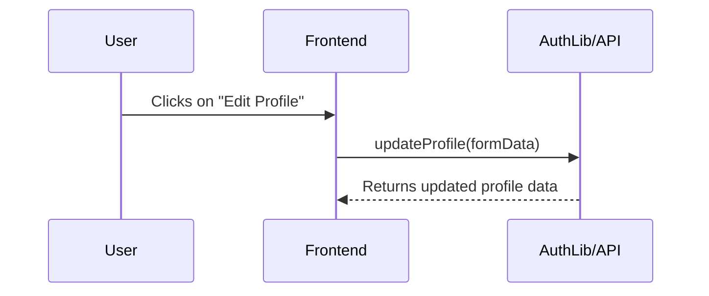
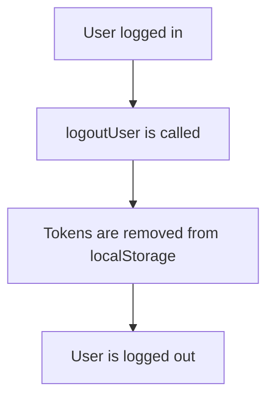

# AuthLib

**AuthLib** is a compact JavaScript library for user authentication and profile management. It provides functions for:

- **Registration** and **2FA (Email verification)**
- **Login** with token management and automatic token refresh
- **Profile management** (retrieval and update)
- **Logout**

The library encapsulates all relevant API calls in one module, so you can easily access them in your event handlers or components.

---

## Table of Contents

- [Installation](#installation)
- [Usage](#usage)
    - [Registration and 2FA](#registration-and-2fa)
    - [Login and Token Refresh](#login-and-token-refresh)
    - [Profile Management](#profile-management)
    - [Logout](#logout)
- [API Functions](#api-functions)
- [Example](#example)
- [Mermaid Diagrams](#mermaid-diagrams)
- [Contributors](#contributors)
- [License](#license)

---

## Installation

1. **Include the file**  
     Include `authLib.js` in your project, e.g. directly in HTML:
     
     ```html
     <script src="path/to/authLib.js"></script>
     ```

Alternatively, you can import the module in an ES module setup.

2. **Configure Backend**  
     Ensure that your backend provides the API endpoints used in the code (e.g. at http://127.0.0.1:8000/api/users).

The library provides several functions that you can use in your event handlers. Here are some typical use cases:

### Registration and 2FA

1. Registration: A new user is created via `registerUser({ username, email, password })`.
2. Verification: Upon successful registration, `sendVerificationCode(email)` is automatically called to send a verification code to the email.

#### Example Code

```javascript
document.getElementById('signup-form').addEventListener('submit', function (event) {
    event.preventDefault();

    const username = document.getElementById('username').value;
    const email = document.getElementById('email').value;
    const password = document.getElementById('password').value;

    AuthLib.registerUser({ username, email, password })
        .then(data => {
            if (data.id) {
                // Registration successful: activate 2FA
                document.getElementById('signup-form').style.display = 'none';
                document.getElementById('2fa-container').style.display = 'block';
                return AuthLib.sendVerificationCode(email);
            } else {
                return Promise.reject(data.error || 'Registration failed.');
            }
        })
        .then(() => {
            alert('Verification code sent to your email!');
        })
        .catch(error => {
            console.error('Error:', error);
            alert('Error: ' + error);
        });
});
```

### Login and Token Refresh

1. Login: Authentication is performed with `loginUser(username, password)`. This stores `accessToken` and `refreshToken` in `localStorage`.
2. Token Refresh: If an API call is made with an expired token (e.g. `getProfile()`), the library automatically attempts to renew the token with `refreshAccessToken()`.

#### Example Code

```javascript
document.getElementById('login-form').addEventListener('submit', function (event) {
    event.preventDefault();

    const username = document.getElementById('login-username').value;
    const password = document.getElementById('login-password').value;

    AuthLib.loginUser(username, password)
        .then(() => {
            document.getElementById('login-form').style.display = 'none';
            document.getElementById('logout-button').style.display = 'block';
            alert('Login successful!');
            return AuthLib.getProfile();
        })
        .then(profileData => {
            console.log('Profile data:', profileData);
            document.getElementById('profile-data').textContent = JSON.stringify(profileData);
            document.getElementById('profile-container').style.display = 'block';
        })
        .catch(error => {
            alert('Login failed: ' + (error.detail || error));
        });
});
```

### Profile Management

1. Retrieval: With `getProfile()` you get the profile data of the currently logged in user.
2. Update: With `updateProfile(formData)` you can update the profile (e.g. bio and avatar).

#### Example Code

```javascript
document.getElementById('edit-profile-button').addEventListener('click', () => {
    const newBio = prompt('Enter new bio:');
    if (!newBio) return;

    const avatarFile = document.getElementById('avatar-input').files[0];
    const formData = new FormData();
    formData.append('bio', newBio);
    if (avatarFile) {
        formData.append('avatar', avatarFile);
    }

    AuthLib.updateProfile(formData)
        .then(updatedData => {
            console.log('Updated profile data:', updatedData);
            // Update the UI with the new data
        })
        .catch(err => {
            console.error(err);
            alert('Profile update failed: ' + err);
        });
});
```

### Logout

With `logoutUser()`, the stored tokens are removed and the user is logged out.

#### Example Code

```javascript
document.getElementById('logout-button').addEventListener('click', function () {
    AuthLib.logoutUser();
    document.getElementById('logout-button').style.display = 'none';
    document.getElementById('login-container').style.display = 'block';
    document.getElementById('profile-container').style.display = 'none';
    alert('Logout successful!');
});
```

## API Functions

The library offers the following functions:

- `getCookie(name)`: Reads the value of a cookie by its name.
- `sendVerificationCode(email)`: Sends a verification code to the specified email.
- `registerUser(data)`: Registers a new user (Expects an object `{ username, email, password }`).
- `verifyCode(email, code)`: Verifies the entered 2FA code.
- `loginUser(username, password)`: Logs in the user and stores the tokens.
- `refreshAccessToken()`: Renews the access token using the stored refresh token.
- `getProfile()`: Retrieves the profile of the logged-in user. If the token is expired, a refresh is automatically performed.
- `updateProfile(formData)`: Updates the user's profile (Expects a `FormData` object, e.g. for updating bio or avatar).
- `logoutUser()`: Logs out the user by removing the tokens.

## Mermaid Diagrams

### Registration & 2FA Flow



### Login & Token-Refresh Flow



### Profile Update Flow



### Logout Flow



## Example

Here is a simple HTML example of how to integrate AuthLib in your project:

```html
<!DOCTYPE html>
<html lang="en">
<head>
    <meta charset="UTF-8">
    <title>AuthLib Example</title>
    <script src="path/to/authLib.js"></script>
</head>
<body>
    <!-- Registration form -->
    <form id="signup-form">
        <input id="username" type="text" placeholder="Username" required>
        <input id="email" type="email" placeholder="Email" required>
        <input id="password" type="password" placeholder="Password" required>
        <button type="submit">Register</button>
    </form>

    <!-- 2FA Container -->
    <div id="2fa-container" style="display:none;">
        <input id="verification-code" type="text" placeholder="Verification code" required>
        <button id="verify-code">Verify code</button>
    </div>

    <!-- Login form -->
    <form id="login-form" style="display:none;">
        <input id="login-username" type="text" placeholder="Username" required>
        <input id="login-password" type="password" placeholder="Password" required>
        <button type="submit">Login</button>
    </form>

    <!-- Profile Container -->
    <div id="profile-container" style="display:none;">
        <div id="profile-data"></div>
        <button id="edit-profile-button">Edit Profile</button>
        <input id="avatar-input" type="file">
        <button id="logout-button">Logout</button>
    </div>

    <script>
        // Here the event handlers shown above are integrated
        // (see the respective code examples in this README)
    </script>
</body>
</html>
```

## Contributors

If you would like to suggest improvements or fix bugs, please open an Issue or a Pull Request.

## License

This project is licensed under the MIT License.

---
