# ft_transcendence_backend - Documentation

## 🚀 Project Overview

**ft_transcendence_backend** is the backend for a full-stack project that uses 2FA-secured authentication with JWT. It is built with **Django** and **Django REST Framework (DRF)** and uses **PostgreSQL** as the database. Communication with the frontend occurs via a **REST API**.

### 🔧 Technologies & Frameworks

- **Python 3.10**
- **Django 5.1**
- **Django REST Framework (DRF)**
- **djangorestframework-simplejwt** (JWT Authentication)
- **PostgreSQL**
- **Docker & Docker Compose**
- **NGINX** (for the frontend)

---

## ⚙️ Setup & Installation

### 1️⃣ **Clone Project & Create Virtual Environment**

```bash
git clone https://github.com/your-repo/ft_transcendence_backend.git
cd ft_transcendence_backend
python3 -m venv venv
source venv/bin/activate  # (Windows: venv\Scripts\activate)
```

### 2️⃣ **Install Dependencies**

```bash
pip install -r requirements.txt
```

### 3️⃣ **Set Environment Variables (`.env` File)**

Create a `.env` file in the `backend/` directory and add the following values:

```ini
POSTGRES_DB=transcendence
POSTGRES_USER=user
POSTGRES_PASSWORD=pass
SECRET_KEY=your-secret-key
DEBUG=True
ALLOWED_HOSTS=*
```

### 4️⃣ **Run Database Migrations**

```bash
python manage.py migrate
python manage.py createsuperuser  # If an admin login is needed
```

### 5️⃣ **Start Server**

```bash
python manage.py runserver 0.0.0.0:8000
```

---

## 🌍 API Documentation

All API endpoints are located under `/api/users/`.

### **🔹 Register a New User**

**POST** `/api/users/register/`

```json
{
  "username": "testuser",
  "email": "test@example.com",
  "password": "securepassword"
}
```

**Response:**

```json
{
  "id": 1,
  "username": "testuser",
  "email": "test@example.com"
}
```

### **🔹 Login (JWT)**

**POST** `/api/users/login/`

```json
{
  "username": "testuser",
  "password": "securepassword"
}
```

**Response:**

```json
{
  "refresh": "eyJhbGciOiJIUzI1NiIsInR5c...",
  "access": "eyJhbGciOiJIUzI1NiIsInR5cCI6..."
}
```

### **🔹 Request 2FA Code**

**POST** `/api/users/verify/send/`

```json
{
  "email": "test@example.com"
}
```

**Response:**

```json
{
  "message": "Verification code sent."
}
```

### **🔹 Verify 2FA Two Factor Authentication Code**

**POST** `/api/users/verify/`

```json
{
  "email": "test@example.com",
  "code": "123456"
}
```

**Response:**

```json
{
  "message": "User verified."
}
```

---

## 🏗️ Architecture & Database Model

### **🔹 CustomUser Model** (`users.models.CustomUser`)

```python
class CustomUser(AbstractUser):
    email = models.EmailField(unique=True)
    avatar = models.ImageField(upload_to='avatars/', null=True, blank=True)
    bio = models.TextField(null=True, blank=True)
    verification_code = models.CharField(max_length=6, blank=True, null=True)
    is_verified = models.BooleanField(default=False)
```

### **🔹 Run Database Migrations**

If changes are made to the models:

```bash
python manage.py makemigrations
python manage.py migrate
```

---

## 🐳 Docker & Deployment

### **1️⃣ Start Backend with Docker**

If you want to use Docker, you can start the backend with `docker-compose`.

```bash
docker-compose up --build
```

To restart only the backend:

```bash
docker-compose restart backend
```

### **2️⃣ Important Docker Commands**

Stop containers:

```bash
docker-compose down
```

View logs:

```bash
docker-compose logs -f
```

---

## 📌 Testing with cURL

### **🔹 Example: Register User**

```bash
curl -X POST http://127.0.0.1:8000/api/users/register/ \
     -H "Content-Type: application/json" \
     -d '{"username": "testuser", "email": "test@example.com", "password": "securepassword"}'
```

### **🔹 Example: Login**

```bash
curl -X POST http://127.0.0.1:8000/api/users/login/ \
     -H "Content-Type: application/json" \
     -d '{"username": "testuser", "password": "securepassword"}'
```

### **🔹 Example: Send 2FA Code**

```bash
curl -X POST http://127.0.0.1:8000/api/users/verify/send/ \
     -H "Content-Type: application/json" \
     -d '{"email": "test@example.com"}'
```

### **🔹 Example: Verify 2FA Code**

```bash
curl -X POST http://127.0.0.1:8000/api/users/verify/ \
     -H "Content-Type: application/json" \
     -d '{"email": "test@example.com", "code": "123456"}'
```

---

## 📝 Conclusion

This documentation provides an overview of:  
✅ Installation & Setup  
✅ API Endpoints  
✅ Authentication with JWT & 2FA  
✅ Database Models & Migrations  
✅ Docker & Deployment  
✅ Example Requests with cURL  

If you need further additions, let me know! 🚀

---

## System Architecture Diagram

```mermaid
graph TD;
    subgraph "🚀 Transcendence Backend System"
        
        subgraph "🟥 Redis (Cache & Message Broker)"
            R1["✅ Fast Storage"]
            R2["🔄 Communication with Django"]
            R3["🗂 Session Storage"]
        end

        subgraph "🐘 PostgreSQL (Database)"
            DB1["📦 Stores User & Game Data"]
            DB2["🔍 Queries & Transactions"]
            DB3["🛠 Uses Healthcheck for Availability"]
        end

        subgraph "🐍 Django Backend (REST API)"
            D1["📡 Provides API for Frontend"]
            D2["🔑 Authentication (JWT & 2FA)"]
            D3["📊 Database Interaction"]
            D4["🔄 Caching & Sessions via Redis"]
        end

        subgraph "🌍 Nginx Reverse Proxy"
            N1["🎭 Forwards Requests to Django"]
            N2["🖥️ Serves Static Frontend"]
            N3["🔒 Can Handle SSL Termination"]
        end

    end

    %% Connections between services
    R1 -.-> D4;
    R2 -.-> D4;
    DB1 --> D3;
    DB2 --> D3;
    DB3 -->|Healthcheck: Is DB reachable?| D3;
    D1 --> N1;
    D2 -->|Authentication via API| N1;
    N1 -->|API Access & Static Files| Browser["🖥️ Web Browser"];

    %% Visual Styling
    classDef service fill:#f9f,stroke:#333,stroke-width:2px;
    classDef database fill:#ffd700,stroke:#333,stroke-width:2px;
    classDef cache fill:#ff6961,stroke:#333,stroke-width:2px;
    classDef proxy fill:#61affe,stroke:#333,stroke-width:2px;
    classDef frontend fill:#85C1E9,stroke:#333,stroke-width:2px;

    class Redis cache;
    class PostgreSQL database;
    class Django service;
    class Nginx proxy;
    class Browser frontend;
```



## Logging and GELF

For Django, you should configure logging to output to **both stdout (console) and GELF (Logstash)**. Here's how to set it up properly:

---

### **Updated Django `LOGGING` Configuration (stdout + GELF)**

```python
LOGGING = {
    'version': 1,
    'disable_existing_loggers': False,
    'formatters': {
        'verbose': {
            'format': '{levelname} {asctime} {module} {process:d} {thread:d} {message}',
            'style': '{',
        },
        'json': {
            '()': 'pythonjsonlogger.jsonlogger.JsonFormatter',
            'format': '''
                %(asctime)s %(levelname)s %(name)s
                %(module)s %(process)d %(thread)d %(message)s
            ''',
        },
    },
    'handlers': {
        'console': {
            'level': 'INFO',
            'class': 'logging.StreamHandler',
            'formatter': 'verbose',
        },
        'gelf': {
            'class': 'pygelf.GelfUdpHandler',  # UDP is faster than TCP for logs
            'host': 'logstash',  # Docker service name
            'port': 12201,       # Default GELF UDP port
            'formatter': 'json', # JSON format for Logstash
            'include_extra_fields': True,  # Optional: Adds Django request metadata
            'compress': True,    # Optional: Compress logs for better performance
        },
    },
    'loggers': {
        'django': {
            'handlers': ['console', 'gelf'],
            'level': 'INFO',
            'propagate': False,
        },
        # Custom app loggers (if needed)
        'myapp': {
            'handlers': ['console', 'gelf'],
            'level': 'DEBUG',
            'propagate': False,
        },
    },
    'root': {
        'handlers': ['console', 'gelf'],
        'level': 'INFO',
    },
}
```

---

### **Key Changes & Why**

1. **Added `StreamHandler` (`console`)**  
   - Logs to stdout (visible in `docker compose logs`).  
   - Uses a human-readable `verbose` format.

2. **GELF Handler (`pygelf.GelfUdpHandler`)**  
   - Sends logs to Logstash in **GELF (Graylog Extended Log Format)**.  
   - Uses **UDP** (faster & connectionless, better for logging).  
   - Includes **JSON formatting** for structured logging.

3. **Separate Loggers for Django & Custom Apps**  
   - Avoids duplicate logs.  
   - Allows different log levels per component.

4. **`propagate=False`**  
   - Prevents double-logging to root logger.

---

### **Required Setup**

1. **Install `pygelf` & `python-json-logger`**  
   ```bash
   pip install pygelf python-json-logger
   ```

2. **Update Logstash Config (`logstash.conf`)**  
   Ensure Logstash accepts GELF UDP input:  
   ```conf
   input {
     gelf {
       port => 12201
       type => "gelf"
     }
   }
   ```

3. **Expose GELF Port in `docker-compose.yml`**  
   ```yaml
   services:
     logstash:
       ports:
         - "12201:12201/udp"  # GELF UDP port
   ```

---

### **Testing**

1. **Check stdout logs**  
   ```bash
   docker compose logs backend
   ```  
   Should show human-readable logs.

2. **Verify Logstash Receives GELF Logs**  
   - Check Logstash container logs:  
     ```bash
     docker compose logs logstash
     ```  
   - Or query Elasticsearch/Kibana if configured.

---

### **Optional Enhancements**

- **Add request metadata** (for HTTP logs):  
  ```python
  'gelf': {
      'class': 'pygelf.GelfUdpHandler',
      'host': 'logstash',
      'port': 12201,
      'include_extra_fields': True,  # Adds Django request info (user, IP, etc.)
  }
  ```

- **Use TCP instead of UDP** (if reliability > speed):  
  ```python
  'class': 'pygelf.GelfTcpHandler',
  ```

- **Add log rotation** (for file logs):  
  ```python
  'file': {
      'class': 'logging.handlers.RotatingFileHandler',
      'filename': '/app/logs/django.log',
      'maxBytes': 5 * 1024 * 1024,  # 5MB
      'backupCount': 3,
  }
  ```

---

### **Final Notes**

- ✅ **Works in Docker**: Uses service names (`logstash`) for networking.  
- ✅ **Structured + Human-Readable Logs**: JSON for machines, `verbose` for humans.  
- ✅ **No More Socket Errors**: GELF avoids Python pickling issues.  

This setup gives you **real-time stdout logs** (for debugging) **+ centralized GELF logs** (for analysis in Logstash/Elasticsearch/Kibana). 🚀