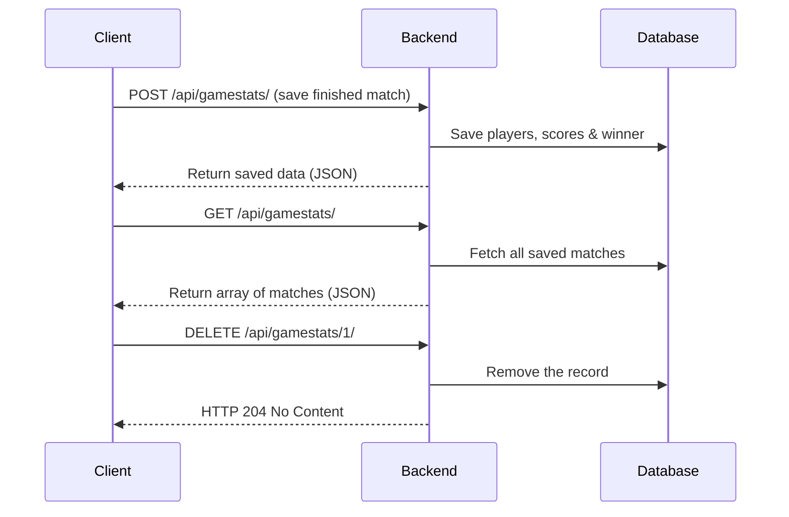

# 🚀 Gamestats API Documentation

This part of the **42 Transcendence Project** covers the **Gamestats API**, which handles the storage and retrieval of finished game results.

---

## ⚠️ Prerequisite

Before using the `gamestats` API, make sure the backend container is correctly prepared.  
Run:
```bash
make test15
```
This will ensure the environment is correctly built, migrations are applied, and the backend is up.

---

## 📊 Available Endpoints

### 📌 1. Retrieve all Gamestats (GET)

```bash
curl -X GET http://localhost:8000/api/gamestats/
```

✅ **Response (empty)**:
```json
[]
```

✅ **Response (with data)**:
```json
[
    {
        "game_id": 1,
        "player1": 1,
        "player2": 2,
        "player1_username": "Alice",
        "player2_username": "Bob",
        "player1_score": 10,
        "player2_score": 7,
        "winner": 1,
        "created_at": "2025-02-27T14:23:15.123456Z"
    }
]
```

---

### 📌 2. Create a new Gamestat (POST)

```bash
curl -X POST http://localhost:8000/api/gamestats/ \
    -H "Content-Type: application/json" \
    -d '{
        "player1": 1,
        "player2": 2,
        "player1_username": "Alice",
        "player2_username": "Bob",
        "player1_score": 10,
        "player2_score": 7,
        "winner": 1
    }'
```

✅ **Response (created)**:
```json
{
    "game_id": 1,
    "player1": 1,
    "player2": 2,
    "player1_username": "Alice",
    "player2_username": "Bob",
    "player1_score": 10,
    "player2_score": 7,
    "winner": 1,
    "created_at": "2025-02-27T14:23:15.123456Z"
}
```

---

### 📌 3. Retrieve a specific Gamestat (GET)

```bash
curl -X GET http://localhost:8000/api/gamestats/1/
```

---

### 📌 4. Delete a Gamestat (DELETE)

```bash
curl -X DELETE http://localhost:8000/api/gamestats/1/
```

---

## 📊 Sequence Flow (Mermaid Diagram)



---

### ⚙️ Development Workflow

```bash
# Make sure everything is up and running
make test15

# Check if gamestats API works
curl -X GET http://localhost:8000/api/gamestats/
```

---

### 🚀 Pro-Tipp
Wenn du die API gerne über **Postman** oder **Insomnia** testen willst, kannst du diese cURL-Befehle direkt importieren!

---

## 📦 Example `docker exec` for migrations inside the backend container

```bash
docker exec -it ft_transcendence-backend-1 python manage.py makemigrations gamestats
docker exec -it ft_transcendence-backend-1 python manage.py migrate
```
