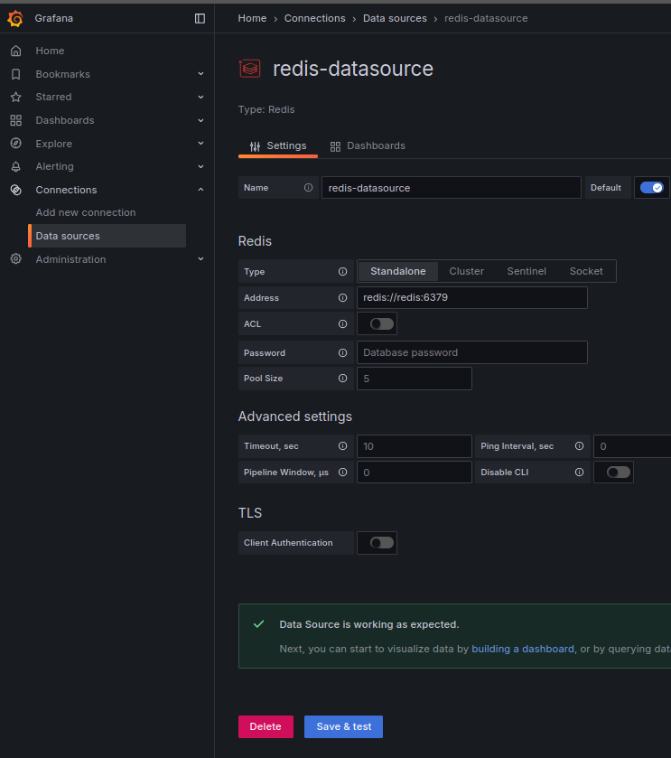
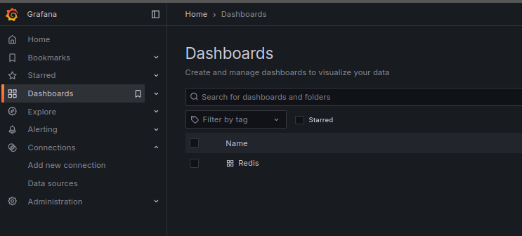
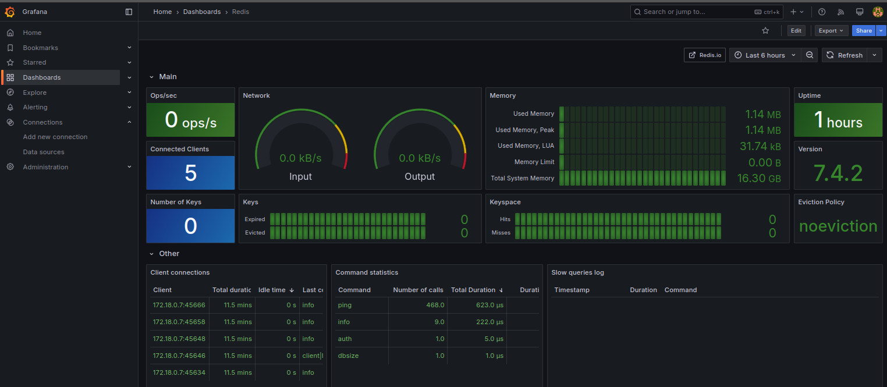

## What is Redis?
Redis (Remote Dictionary Server) is an open-source, in-memory data structure store used as:
- Database
- Cache
- Message broker
- Real-time data store

Key Features:
- Extremely fast (in-memory access)
- Supports various data structures (strings, hashes, lists, sets)
- Persistence options
- Pub/Sub messaging pattern

## Redis in this Project
### Check if Redis is running:
```bash
docker-compose exec redis redis-cli
```

## Basic connectivity test:
```bash
127.0.0.1:6379> ping
PONG
```

## Test data storage:
```bash
127.0.0.1:6379> set mykey "Hello, Redis!"
OK
127.0.0.1:6379> get mykey
"Hello, Redis!"
127.0.0.1:6379> del mykey
(integer) 1
127.0.0.1:6379> get mykey
(nil)
```

## Test Pub/Sub (Game Server):
Terminal 1 (Subscriber):
```bash
127.0.0.1:6379> subscribe game_channel
```

Terminal 2 (Publisher):
```bash
127.0.0.1:6379> publish game_channel "Test message"
```

## Useful commands:
```bash
127.0.0.1:6379> keys * (List all keys)
127.0.0.1:6379> set (Set key value)
127.0.0.1:6379> get (Get value of key)
127.0.0.1:6379> del (Delete key)
127.0.0.1:6379> del * (Delete all keys)
127.0.0.1:6379> info (Get server information)
127.0.0.1:6379> monitor (Log all commands)
127.0.0.1:6379> flushdb (Delete all keys in current database)
```

## Flush all data:
```bash
docker-compose exec redis redis-cli flushall
```

## Chat
```bash
# Terminal 1 (Subscriber)
docker-compose exec redis redis-cli
127.0.0.1:6379> SUBSCRIBE chat_general

# Terminal 2 (Publisher)
docker-compose exec redis redis-cli
127.0.0.1:6379> PUBLISH chat_general "Hello world!"
```

## From the mac

Install redis-cli
```bash
brew install redis
```
The you will be able to login into the running container with
```bash
laurentb@MutantBot ft_transcendence % redis-cli -p 6380
127.0.0.1:6380> keys
(error) ERR wrong number of arguments for 'keys' command
127.0.0.1:6380> keys *
(empty array)
```

## redis in grafana

In Grafana you can import a dashboard. When going to localhost:3000, you can import a dashboard from the grafana.com. First go to connections data source, there will be a plus `+` button on the top right. You will be able to import the standard redis dashboard with 12776.
electing your redis data source, you can import the dashboard and connect it.
Then you will be able to see the dashboard with the data from the redis server.
I will add some screenshots of the process. This is how the page looks like when you are connecting the redis data source.  


with save and test you can check if the connection is working.  

Next you will add the dashboard with id 12776.  
This is how it will look like:


You click on redis and you get to the dashboard.  

